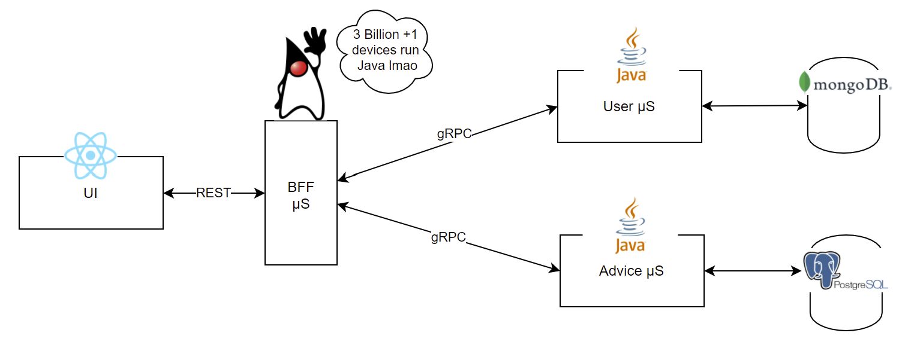
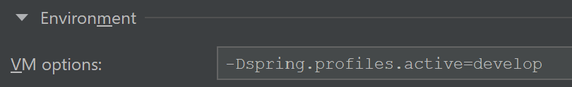
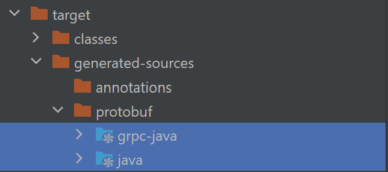

# Microservices Java gRPC

[Deployed in EC2, Check it out!](http://ec2-18-192-156-217.eu-central-1.compute.amazonaws.com/java)

This repo contains microservices written in Java with BFF pattern for performing CRUD operations. 
- [For Kotlin version, click me!](https://github.com/uid4oe/microservices-kotlin-grpc/)
- [For Go version, click me!](https://github.com/uid4oe/microservices-go-grpc/)





## Installation
Clone the repository
```bash
git clone https://github.com/uid4oe/microservices-java-grpc.git
```

You should have Docker installed beforehand.

`.env` is included. You just need to create network & execute `docker-compose` command

```bash
docker network create uid4oe
docker-compose up -d
```

At this point everything should be up and running! You can access to UI at 

```bash
http://localhost:3000/java
```


Additionally, you may take a look at [Microservices gRPC UI](https://github.com/uid4oe/microservices-grpc-ui/) for UI code.

## Local Development
For running services in local environment you will need a MongoDB & PostgreSQL instance, you can use `local.yml`
It will set up MongoDB, PostgreSQL and UI.

```bash
docker network create uid4oe
docker compose --file local.yml up -d
```

Do not forget to add below VM argument to every service.

```bash
-Dspring.profiles.active=develop
```




Also, for each service add `grpc-java` & `java` folders as `Sources` in 
`File->Project Structure`. This will allow IDE to see the generated gRPC classes.




You can start using the app through UI at 
```bash
http://localhost:3000/java
```


## Contributing
Pull requests are welcome. For major changes, please open an issue first to discuss what you would like to change.


